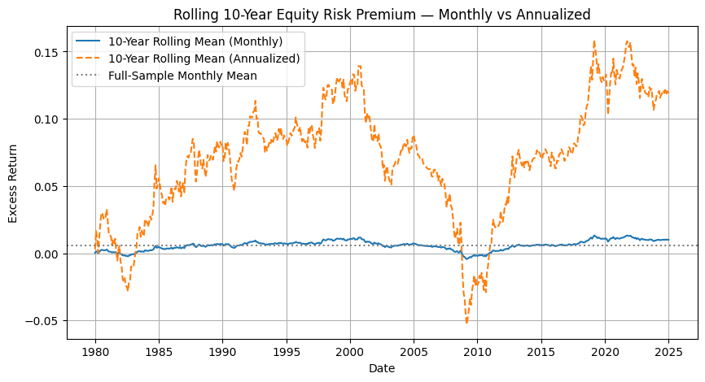

# Equity Risk Premium Analysis

### 🎯 Objective
Estimate and analyze the **U.S. equity risk premium (ERP)** from 1970–2024 using both historical and forward-looking approaches.

### 💡 Research Motivation
The **equity risk premium** represents the extra return investors require for holding risky equities over risk-free assets.  
Understanding its magnitude, variability, and determinants is central to asset pricing and long-term investment strategy.

### 📊 Data Summary

The analysis uses monthly U.S. market and macroeconomic data from **1970 to 2025**,  
compiled from the **Kenneth R. French Data Library**, **FRED**, and **CRSP** databases.  
The dataset includes market returns, T-bill and bond yields, dividend-price ratios,  
and other variables commonly used in equity premium research.  

A full description of the data structure and sources is available in  
[`data_overview.md`](data/data_overview.md)

### 🧮 Methodology
1. **Historical ERP Estimation** — Compute mean excess return of equities over T-bills and construct confidence intervals via OLS regression.  
2. **Rolling Stability Analysis** — Evaluate the 10-year rolling ERP to study time variation and macroeconomic regimes.  
3. **Forward-Looking Models** — Estimate ERP using valuation-based approaches:  
   - Gordon Growth Model (Dividend Yield + Growth − TIPS Yield)  
   - Earnings Yield Model (E/P − Real Bond Yield)  
4. **Risk Metrics** — Assess Sharpe ratio, volatility, skewness, kurtosis, Value-at-Risk (VaR), and Expected Shortfall (ES).  
5. **Visualization & Diagnostics** — Present ERP trends and volatility diagnostics through rolling plots and summary tables.

### 📊 Key Results
- Average annualized ERP: **≈ 6–7%**, statistically significant (t ≈ 3.3).  
- Rolling ERP reveals substantial time variation, declining post-2008.  
- Forward-looking estimates (GGM, E/P) suggest current ERP of **~2–3% (real terms)**.  
- Distribution diagnostics indicate **fat tails and negative skewness**, consistent with equity downside risk.

### 📈 Visualization

Below is the **10-year rolling (120-month) average of the equity risk premium (ERP)**, highlighting major shifts in investor risk appetite and market regimes.

The chart illustrates how realized ERP fluctuates over time — rising during recovery periods (e.g., post-2009) and declining during high-valuation or low-yield environments.  
It visually supports the finding that the **ERP is positive but unstable**.

Additional figures, including the monthly ERP series, are available in  
[`outputs/figures`](outputs/figures).

### 🧠 Insights
- The ERP is **positive but unstable** — it fluctuates with valuation and macroeconomic conditions.  
- Historical and valuation-based measures can diverge due to changing risk-free rates and growth expectations.  
- Understanding ERP dynamics is critical for forecasting returns and calibrating portfolio risk models.

### ⚙️ Tools
Python · pandas · numpy · statsmodels · matplotlib · scipy  
Empirical Asset Pricing · Risk Analytics · Time-Series Modeling

---

*This research was independently conducted as part of my quantitative finance studies.*
